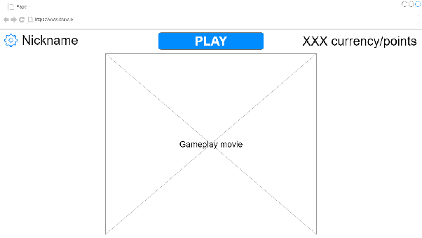
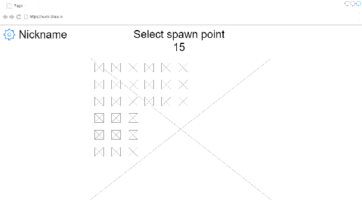
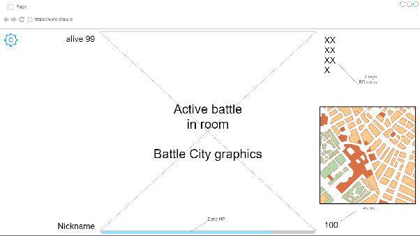
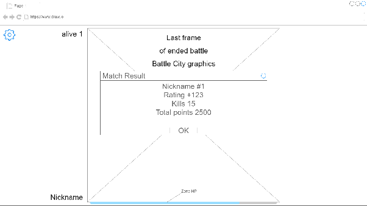

# Game Design Document

# Abbreviations

BC - Battle City

BCR - Battle City Royale

CD - Cool Down

# Concept

The game is a combination of Battle City and the Battle Royale genre.

Taken from Battle City:

* graphics;
* controls;
* gameplay mechanics (timings in seconds, interactions, bonuses);
* objects.

Additions from the Battle Royale genre (to the rules above):

1. multiple players (20 - 100) play on the map at the same time
2. each player has 1 life
3. the goal is to be the only survivor
4. some areas of the game map become dangerous to stay in, forcing players closer together

Battle City Royale features (partly inspired by Ring of Elysium, Game for Peace, PUBG):

The map consists of 100 rooms (10x10). A room is a standard Battle City map. Transitions between rooms are performed through the room borders. Players can only see the room they are currently in. What happens in other rooms is hidden from them. The player's camera is not attached to the tank and is fixed to the current room.

The dangerous zone begins to appear from the edge of the map. A room becomes part of the dangerous zone all at once. Before a room turns into a dangerous zone, players see a warning and a countdown. Players have access to a mini-map with all rooms so they can see where the safe zone will be and move there.

In the center of the final remaining safe room, a base will appear that players must drive into to win.
Players have an additional meter: dangerous-zone health, which decreases while they are in the dangerous zone. Over time, the drain speed increases. The meter restores at a rate of 1 unit/sec. The player loses when this meter reaches 0.

# Gameplay Mechanics

### Units of Measurement

In BC the units of measurement were:

* time - frames
* distance - pixels, px
* speed - px/frame

For BCR:

* time - seconds, sec
* distance - game field cells, cells
* speed - cells/sec

All parameters will be converted using these formulas:

1 frame = 1/64 sec

1 px = 1/16 cell

1 px/frame = 4 cells/sec

Distance between objects is measured using Manhattan distance.

### Movement

The player controls only their own tank.

Movement is possible in only one direction at a time: either horizontal or vertical.

When colliding with obstacles, the tank stops. Obstacles are: walls, water, other tanks. When colliding with a bonus, the bonus is applied.

Tank movement speed: 3 cells/sec, numeric values taken from BC.

### Shooting

The tank can shoot. When firing, the projectile appears from the center of the front side of the player's tank (the cannon on the sprite).

In BC the player could have only 1 projectile on the map and could shoot again only after that projectile was destroyed. In BCR this restriction is removed.

Fire rate comes in two variants: slow (CD 1 sec) and fast (CD 0.5 sec). The CD values are chosen so that projectiles fly with gaps of 8 cells (4 for fast) and there is 1 projectile per half of a room field (2 for fast).

### Projectiles

Projectiles have two speed types: slow (8 cells/sec) and fast (16 cells/sec). Numeric values are taken from BC.

Projectiles have two penetration types: standard and enhanced. A standard projectile penetrates one quarter of a brick wall and cannot penetrate a concrete wall. An enhanced projectile penetrates half of a brick wall and can penetrate a concrete wall.

When a projectile hits an obstacle, it affects the obstacle and disappears from the game field.

When a projectile hits a wall that it can penetrate, the wall section perpendicular to the projectile trajectory is destroyed.

When two projectiles collide, they destroy each other.

### Tank Destruction

When a projectile hits a tank, the tank is destroyed, the shooting player gets a kill, and the target player gets a defeat.

When defeated, the losing player's tank disappears and drops a Star bonus if it was level 2-3.

When a player gets a kill, they receive one kill point (frag). Later, frags affect the player's final result.

Rules for team play:

If a player's projectile hits a friendly tank, that tank is immobilized for 3 sec.

If there are living teammates, a Tank bonus drops.

### Bush

When an object enters a bush, it disappears from the visibility area of non-allied players.

The following can hide in a bush: tanks, projectiles, bonuses.

### Ice

When a tank enters ice, sliding begins. After the engine stops (movement keys released), a sliding tank continues moving for 0.5 sec in the previous direction. The sliding time is taken from BC.

If a sliding tank reaches ground or collides with an obstacle, it stops.

### Bonuses

A bonus appears on a passable part of the game area or after tank destruction. The interaction area with a bonus is a game field cell. For interaction, the tank center must move into that cell. Upon interaction, the bonus is applied.

BC bonus types:

1. Helmet - temporary invulnerability.
2. Clock - freezes enemies.
3. Shovel - creates a concrete wall around the base.
4. Star - increases tank level.
5. Grenade - destroys all enemies on the screen without awarding points.
6. Tank - grants +1 life.
7. Pistol - did not work, possibly maximum increase of the player's tank level.

Bonus modifications for BCR:

1. Helmet - invulnerability for 5 sec. Time taken from BC.
2. Clock - restores the dangerous-zone meter by 50% / slows enemies in the room by 20% for 5 sec. Not decided yet.
3. Shovel - creates concrete walls around all bases in the room for 10 sec. During the last 4 seconds, the walls flash in brick/concrete colors. Time taken from BC.
4. Star - increases tank level.
5. Grenade - turns the current room into a dangerous zone for 10 sec.
6. Tank - allows reviving a teammate at the respawn base. Drops after a teammate dies at the place of death. Disabled in solo mode. A Tank bonus of another team cannot be picked up.
7. Pistol - maximum increase of the player's tank level. Highlighted for all players on the mini-map, even in bushes. Players see its future position 10 seconds before it appears. (airdrop and full T3 set)

### Tank Levels

When the tank level changes, one or more parameters change:

* projectile speed
* fire rate
* projectile penetration

The tank appearance also changes with level. Sprites are taken entirely from BC.

Level features are taken entirely from BC.

| Level | Projectile Speed | Fire Rate | Penetration |
| :---- | :---- | :---- | :---- |
| 0 | slow | slow | standard |
| 1 | fast | slow | standard |
| 2 | fast | fast | standard |
| 3 | fast | fast | enhanced |

### Tank Visibility

The player always sees their own tank, colored gold.

The player sees allied tanks on the map and in their room, even in bushes, colored green.

Enemy tanks are visible only if they are in the same room and not hiding in bushes, colored gray.

### Mini-map

The player constantly sees a mini-map with rooms.

Rooms with the dangerous zone are darkened in red.

Rooms that will become dangerous in the next phase are darkened in yellow.

Teammates are marked on the mini-map with large dots.

The player is gold, teammates are green.

### Dangerous Zone

The game is divided into several phases. In each phase, several rooms are marked that will become dangerous in the next phase. The safe zone will always remain a single connected area and will never split.

In the penultimate phase, one room remains in the safe zone, and a victory-exit base appears there 5 seconds before the phase ends.

In the final phase, everyone who has not exited dies; this is the cleanup phase.

Players have an additional meter: dangerous-zone points, which decrease in the dangerous zone (a real value from 0 to 1). In each phase the damage per second in the dangerous zone increases. The meter restores at a rate of 1%/sec when the player is in the safe zone. The player loses when this meter reaches 0.

Phase parameters

| Number | Safe Rooms, % | Damage, %/sec | Duration, sec |
| :---- | :---- | :---- | :---- |
| 1 | 100 | 0 | 30 |
| 2 | 76 | 1 | 26 |
| 3 | 56 | 2 | 22 |
| 4 | 39 | 3 | 19 |
| 5 | 25 | 5 | 16 |
| 6 | 14 | 7 | 14 |
| 7 | 6 | 9 | 12 |
| 8 | 1 | 12 | 11 |
| 9 - Cleanup | 0 | 15 | 10 |

Total time until cleanup: 150 seconds = 2.5 minutes.

Total duration of all phases: 160 seconds < 3 minutes.

### Initial Placement

Players choose an initial spawn room on an enlarged mini-map.

At the start, there will definitely be no enemy tanks in the same room.

Players may choose a room with allies and may not choose a room occupied by opponents.

Players can see occupied rooms and therefore know the enemies' starting positions.

If a player does not choose a room, they are placed into a random one.

Temporary invulnerability is applied on initial spawn.

### Transition Between Rooms

Crossing a room border transitions the tank into the neighboring room through that border.

On outer edge rooms, an impassable barrier is placed along the map boundary.

After entering a neighboring room, temporary invulnerability is applied to the player.

### Temporary Invulnerability

Temporary invulnerability absorbs projectiles completely without explosions. Absorbed projectiles are removed from the game without any of the standard effects.

On initial placement it is applied for 3 sec.

When transitioning into a new room, temporary invulnerability is applied with duration depending on level. The level increases by 1 every 5 sec (the time needed to cross a room from one edge to the other) after a transition. After each transition, the level decreases by 1 and the timer resets. Maximum level is 4, minimum is 0.

| Level | Time, sec |
| :---- | :---- |
| 0 | 0 |
| 1 | 0.5 |
| 2 | 1.0 |
| 3 | 1.5 |
| 4 | 2.0 |

# Interface

### Lobby

### Battle Start

### Battle

### Results

# Systems and Algorithms

## Numbering

Rooms are numbered from left to right, top to bottom, row by row.

Cells are numbered from left to right, top to bottom, row by row.

## Tank Model

Each tank has:

1. level
2. movement state / direction
3. time of last shot
4. dangerous-zone HP
5. X, Y coordinates

## Controls

The player can only change the tank's movement state. After receiving a movement command, that tank movement state changes.
When the player presses the shoot button, the tank may fire. If enough time has passed since the previous shot according to the CD, the shoot command is executed.

Shooting spawns a projectile and sets the shot time to the current time.

## Movement

### Integration

Add velocity to the coordinates.

### Collision Search

For each cell, build a list of objects that occupy that cell. A tree is not needed because there are few cells and each will contain few moving objects. Objects intersecting multiple cells are added to each of those cell lists.

On each physics simulation iteration, update the lists instead of rebuilding them from scratch.

Only when several objects and 1+ moving object are found in the same cell, check each moving object against every other object.

When collisions are found, apply all effects of each collision object.

### Collision Effects

Objects may undergo the following effects:

1. explosion (E) - remove the object from the system with an explosion animation at the object's center
2. effect (FX) - remove the object from the system with a specific effect (animation, score award)
3. stop (S) - stop the object
4. disappearance (-) - apply invisibility
5. nothing / ignore ( ) - the collision is simply ignored.

This table shows what happens to the object in the row when colliding with the object in the column:

|  | 1 | 2 | 3 | 4 | 5 | 6 | 7 | 8 |
| :---- | :---- | :---- | :---- | :---- | :---- | :---- | :---- | :---- |
| Tank | S | FX | FX | S | S | S | - | S |
| Standard Bullet | E | E | E | E | E |  | - |  |
| Enhanced Bullet | E | E | E | E | E |  | - |  |
| Brick Wall |  | E | E |  |  |  |  |  |
| Concrete Wall |  |  | E |  |  |  |  |  |
| Bonus | FX |  |  |  |  |  | - |  |
| Bush |  |  |  |  |  |  |  |  |
| Water |  |  |  |  |  |  |  |  |

### Simplifications

Objects move discretely by 1/32 of a cell.

After processing each object, mark the cells where movement occurred. After processing all objects, search for collisions in the marked cells.

After a bullet contacts a wall, find all affected cells and delete them.

For the invisibility effect, bushes should have a separate invisibility area for bullets and a separate invisibility area for tanks.

Create a separate area for each room to detect collisions with it.

Create areas for the dangerous zone for each room as well.

### Effects in an Area

#### Tank-Room enter:

1. The tank appears in the visibility of all players in that room.
2. Temporary invulnerability is applied to the tank.
3. All visible dynamic objects in the room are added to the player's visibility area.

#### Tank-Room exit:

1. The tank disappears from the visibility of all enemy players in that room.
2. All dynamic objects in that room are removed from the player's visibility area.

#### Tank-Dangerous Zone enter:

1. The tank receives the dangerous-zone point drain effect.
2. The tank's dangerous-zone point restoration effect is canceled.

#### Tank-Dangerous Zone exit:

1. The tank receives the dangerous-zone point restoration effect.
2. The tank's dangerous-zone point drain effect is canceled.

#### Bullet (any) - Room enter:

1. The bullet appears in the visibility area of players in that room.

#### Bullet (any) - Room exit:

1. The bullet is removed without effects.
2. The bullet disappears from the visibility area of players in that room.

## Map

The client receives data about the initial placement of all map objects.

The client receives event data for each map object, meaning the game field should always remain up to date.

## Client Data Updates

Because all moving objects always move uniformly in straight lines, it is sufficient to send the client the initial point and movement direction. All other coordinates can be computed from the line equation.

The client receives only events with changes in object state.

State changes are considered to be:

* appearance in the visibility area
* disappearance from the visibility area (hidden in bushes, leaving the map, picking up a bonus)
* movement change (stop, direction change, movement start)
* destruction with explosion (tank, wall, projectile)
* room danger state

## Bonus Spawn

After testing the physics engine.

## Safe Zone Shrinking

The order in which rooms become part of the dangerous zone is formed at the room selection stage using a pre-generated key.

The algorithm must return the same array of room numbers every time for the same run.

The algorithm parameters are:

1. random-number key;
2. number of rooms on one side of the map.

Algorithm:

1. Build an undirected graph whose vertices are rooms.
2. Find the graph center: 1-4 vertices. (?too resource-intensive, changes possible)
3. Find the distance from each vertex to the graph center. (wave algorithm from the center)
4. Build an array of vertices that are farther than 75% of the graph radius from the center and do not cause disconnections.
5. Sort the vertices in the array by vertex number.
6. Using the key, generate an index into the array.
7. Remove the vertex with the found index from the graph and add it to the result array.
8. While more than 1 vertex remains, go to step 2.

Vertices that cause disconnections are vertices with 2 neighbors whose distance to the center is +1 and -1 relative to the distance of the current vertex.

## Matchmaker

### Stage 1

Contains the queue of active clients.

When requesting to join a battle, the client is put into the queue and an attempt is made to create a session.

When requesting to leave the battle queue, the client is removed from the queue.

Attempt to create a session:

1. Check queue length
2. If there are enough players in the queue, all players assigned to the session are removed from the queue
3. A session is formed with all parameters
4. The session is cached and sent to the session server
5. On success, all clients are sent the key and the session server address
6. The next attempt to create a session is performed

When the session ends, it is removed from cache and the result is sent to all clients.

All queue operations must be performed in mutually exclusive mode.

### Stage 2

After the rating system is introduced.

## Score Distribution

After the rating system is introduced. Presumably by the Elo system.

## Session

When the session server receives a session:

1. generates unique tokens for each client
2. sends these tokens back to the matchmaker
3. creates a session container
4. waits for connections by token and attaches the connections to the container

When the session ends:

1. sends the result to the matchmaker

## Session Container

Contains:

1. the game engine, running in a separate thread
2. connections for all session players, each in a separate thread

Tasks:

1. proxy and router between the game engine and client connections
2. terminate all session connections

## Game Engine

Works with all game entities.

Requests a physics simulation tick from the physics engine and receives all events for collisions.

Processes collisions and generates events.

Routes events into the container.

Loads the map into the physics engine and sends the map to clients.

Generates the room-shrinking order.

Generates teammate respawn bases.

Creates player-controlled objects in the physics engine.

Places player-controlled objects.

Changes room states and generates room-state change events.

Generates and returns events on movement-state changes and visibility changes.

Generates events when objects are destroyed.

## Physics Engine

Computes world physics for 1 tick on request and returns all events for that tick.

Responsible for movement and collision detection.

The world is discrete. The smallest part of space any object can move by is 1/32 of a cell. If an object does not move for several ticks, it is frozen and skips some calculations.

### Algorithm

1. Process all unfrozen dynamic objects:
   1. shift by velocity in the required direction
   2. calculate the next movement tick
   3. freeze until the calculated tick
   4. mark the field cells containing this object
2. Search for collisions with objects that moved during this tick

## Map Storage

For each map the following are stored:

* room size by one side in cells
* map size by one side in rooms
* arrays of objects (by type) with coordinates on the map with 1/2 cell precision

Objects (size in parentheses):

* concrete wall (0.5 x 0.5)
* brick wall (0.5 x 0.5)
* bush (0.5 x 0.5)
* water (0.5 x 0.5)
* ice (0.5 x 0.5)
* tank spawn point (1 x 1)
* bonus spawn point (1 x 1)
* base spawn point (1 x 1)

Coordinates are integer values where 1 unit = 0.5 cell.

The map is stored on the server in JSON format.

# Graphics

## Engine

Use BC textures.

Render by overlaying sprites.

Update only the changing cells.

Updates are performed in layers in this order:

1. Fill black
2. Map textures (static objects)
3. Textures of dynamic objects

## Texture List

## Stage 1

Empty map with a moving player.

Schematic tank.

No animation.

## Stage 2

Full animation.
All textures.

# Sound

Use sound from BC.

Find a ready-made collection or synthesize from the original assets.

Play sound at the moment of the event.

# Story

Each player survives in a battle with several equal opponents and one or more of them wins.

## Client Game Stages

1. Waiting for players to connect
2. Room selection
3. Active play
4. Spectating after death
5. Final result

## Server Game Stages

1. Waiting for players to connect
2. Start of room selection
3. Room locking
4. Initial placement
5. Active play
6. End, sending results

# Game World

One map with multiple rooms, 3 minutes for battle and survival.
